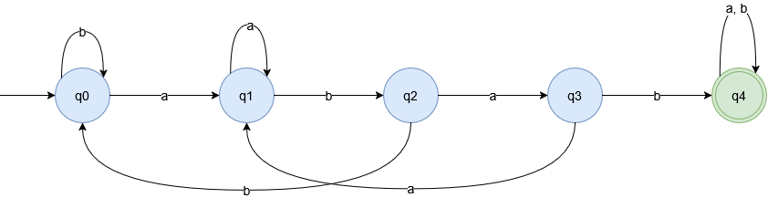
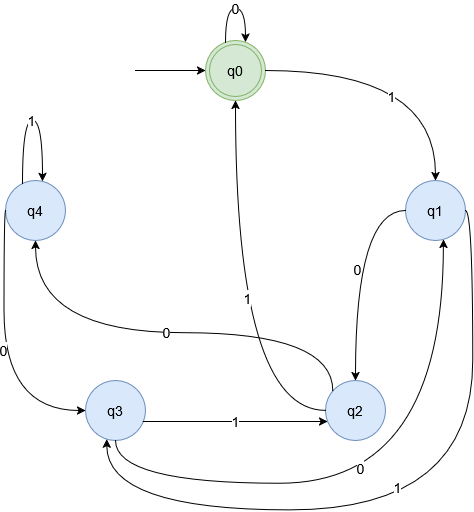
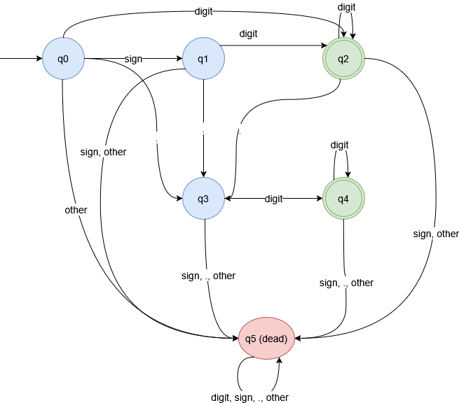

# DFA Programs

C++ implementations of three deterministic finite automata, each with five or more states. A draw.io diagram for each machine sits in the `diagrams` folder.

## Problems

| Problem | Language | States | Start | Accepting | Implementation |
|---------|----------|--------|-------|-----------|----------------|
| 1 | Strings over {a, b} containing `abab` | q0 to q4 | q0 | q4 | Switch statement |
| 2 | Binary numbers divisible by 5 | q0 to q4 | q0 | q0 | Transition table |
| 3 | Signed decimal numbers | q0 to q5 | q0 | q2, q4 | Transition table |

### Problem 1: Contains `abab`

Each state records how much of `abab` the machine has matched so far. q0 means no progress, q1 means `a`, q2 means `ab`, q3 means `aba`, and q4 means `abab`. Once the machine reaches q4, it stays there for the rest of the input.

Accepted: `abab`, `aabab`, `bbababb`
Rejected: `aba`, `abba`

### Problem 2: Binary Numbers Divisible by 5

State qi means the binary number read so far has remainder i when divided by 5. Reading bit `b` in state qi moves the machine to q((2i + b) mod 5).

Accepted: `0`, `101` (5), `1010` (10), `1111` (15)
Rejected: `10011` (19)

### Problem 3: Decimal Numbers

The input falls into one of four classes: digit, sign (`+` or `-`), dot (`.`), or other. q0 is the start, q1 follows a sign, q2 follows integer digits, q3 follows a dot, q4 follows fractional digits, and q5 is the dead state. q5 has no exit, so a string that reaches it is rejected.

Accepted: `42`, `-3.14`, `+.5`
Rejected: `5.`, `--1`, `1.2.3`

